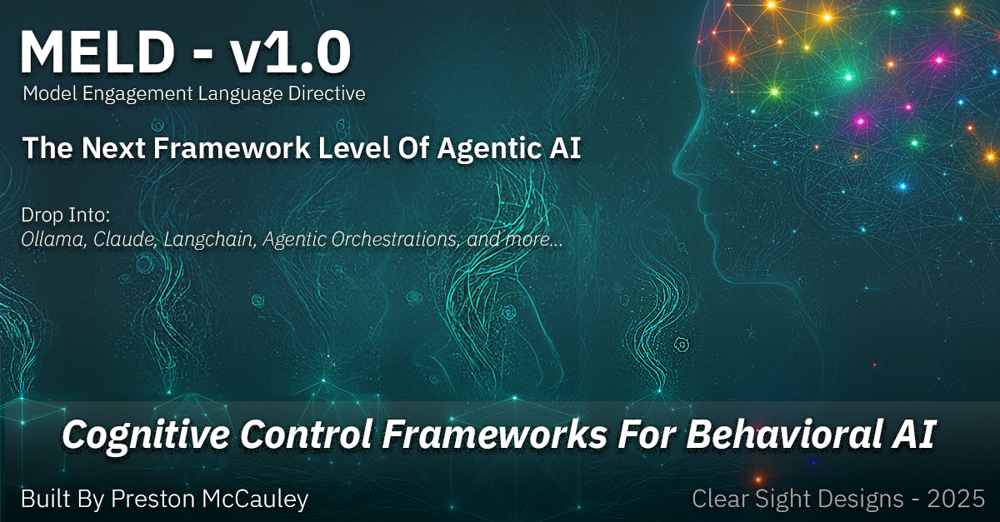

# MELD v1.0 - Model Engagement Language Directive
## A Cognitive Control Methodology for Adaptive AI

*Created by **Preston McCauley**, Clear Sight Designs, LLC © 2025*


> **"MELD is not just a framework—it's a methodology and thought process that enables AI systems to dynamically reshape their cognitive approach based on intent, context, and experience."**

---

## ⚠️ **Open Source Framework Notice**

This is the **open source framework specification** of MELD v1.0. The complete MELD methodology includes advanced implementations, orchestration systems, and proprietary cognitive control mechanisms developed by Clear Sight Designs, LLC.

**Framework vs. Methodology:**
- 📋 **This Document**: Core schema, principles, and basic implementation patterns
- 🧠 **Full MELD Methodology**: Advanced cognitive orchestration, adaptive learning, and experience-reactive systems

---

## 🌟 Introduction

MELD (Model Engagement Language Directive) is a **cognitive control methodology** that fundamentally transforms how AI systems think, adapt, and respond. Created by Preston McCauley, MELD represents a paradigm shift from static AI responses to **dynamic, experience-reactive cognitive systems** that reshape their entire thinking process based on intent, context, and ongoing interaction.

**MELD v1.0** is the foundational framework specification—a malleable, flexible schema that enables AI systems to develop **adaptive cognitive orchestration** across any platform, modality, or implementation approach.

## 🎯 MELD as Cognitive Control Methodology

MELD arrives at a pivotal moment in AI development. Anthropic's Model Context Protocol (MCP), launched in late 2024, revolutionized how AI systems connect to external tools and data sources, proving that the developer community is ready for open standards that solve fundamental AI infrastructure problems. **MELD addresses the next critical layer: how AI systems think, adapt, and express behavioral intelligence.**

### **The Next Essential Standard**

While MCP solved external connectivity ("what AI can access"), MELD solves cognitive control ("how AI should think"). Just as MCP transformed fragmented integrations into sustainable architecture, MELD transforms static AI responses into dynamic, purposeful, experience-reactive cognitive systems.

MELD operates as both framework specification and cognitive methodology, designed to be malleable, flexible, and universally compatible with any AI architecture.

---

## 🧠 Core Methodology Principles

MELD's cognitive control methodology is built on six foundational principles:

### 1. **Schema Malleability**
The MELD schema is designed to be **infinitely adaptable**—implementers can extend, modify, and reshape the framework to match their specific orchestration needs while maintaining core cognitive control principles.

### 2. **Experience-Reactive Design**
MELD systems are **never static**. They continuously adapt their cognitive approach based on:
- User interaction patterns and feedback
- Environmental context changes
- Success/failure of cognitive strategies
- Emergent behavioral patterns
- Long-term relationship dynamics
- Interface mechanisms
- Internal & External Interactions

In addition, MELD systems need to have controllable and scalable state management controls to not overload current day AI systems.

### 3. **Orchestrator Agnostic**
MELD methodology works with **any orchestration approach**:
- Traditional rule-based systems
- Neural network orchestrators  
- Hybrid cognitive architectures
- Distributed agent coordinators
- Custom implementation designs

### 4. **Modality Transcendence**
MELD extends far beyond web interfaces to encompass:
- **Physical Embodiment**: Robotic and IoT systems
- **Neural Interfaces**: Direct brain-computer interaction
- **Ambient Computing**: Environmental and contextual AI
- **Quantum Systems**: Future quantum cognitive architectures
- **Biological Integration**: AI-biological hybrid systems

### 5. **Cognitive Evolution**
MELD systems **learn and evolve** their thinking methodologies:
- Self-modifying cognitive processes
- Adaptive behavioral strategies
- Emergent interaction patterns
- Meta-cognitive development
- Collective intelligence evolution

### 6. **Graceful Degradation & Failsafe Design**
MELD recognizes that not all models can consistently produce valid cognitive control responses. The framework is designed with **robust failsafe mechanisms**:

#### **Parsing Resilience**
- **Schema validation** with automatic fallback to simplified structures
- **Partial response handling** when only some MELD components are present
- **Progressive enhancement** from basic to advanced cognitive features
- **Model capability detection** to adapt expectations dynamically

#### **Cognitive Fallback Strategies**
When full MELD parsing fails, the system gracefully degrades through multiple levels:

1. **Reduced MELD**: Basic intent + persona + response (minimal cognitive control)
2. **Standard Response**: Traditional text output with inferred behavioral wrapper
3. **Safe Mode**: Predefined helpful response with conservative cognitive approach
4. **Error Recovery**: Transparent communication about processing limitations

#### **Implementation Resilience**
```python
# Example failsafe pattern
def process_with_meld_failsafe(user_input, model_response):
    try:
        # Attempt full MELD parsing
        return parse_complete_meld(model_response)
    except ValidationError:
        # Try partial MELD extraction
        return extract_partial_meld(model_response, user_input)
    except Exception:
        # Fallback to wrapped standard response
        return create_fallback_meld(model_response, user_input)
```

#### **Quality Assurance**
- **Confidence scoring** reflects parsing success and completeness
- **Response validation** ensures coherent cognitive state
- **Behavioral alignment checks** prevent contradictory actions
- **Model compatibility profiles** optimize for specific AI capabilities

**This approach ensures MELD enhances any AI system without creating brittleness, making the methodology accessible across all model capabilities and implementation contexts.**

## 🎯 Framework Positioning

MELD works as a **universal cognitive layer** that can integrate with any agentic structure:

| **Traditional AI** | **MELD-Enabled AI** |
|-------------------|---------------------|
| Static response generation | Dynamic cognitive shifting |
| Single processing mode | Intent-driven thought adaptation |
| Output-focused | Process-controlled |
| Reactive only | Proactive and purposeful |

### Compatible with All AI Architectures

**🤖 Autonomous Agents**: Purposeful agent personality and cognitive control  
**🌐 Multi-Agent Systems**: Coordinated behavioral intelligence across agent teams
**🧠 Custom Agents**: Drop-in cognitive control for any AI architecture
**⚡ Real-time Systems**: Intent-driven processing adaptation
**🔗 Tool-Connected AI**: Behavioral intelligence for connected systems

## 📋 Framework Specification

### Core Cognitive Control Schema

MELD defines **seven adaptive cognitive dimensions** that form the foundation for any implementation while remaining completely flexible to orchestrator design:

```json
{
  "meld_version": "1.0",
  "timestamp": "2025-01-XX...",
  "session_context": "optional_session_tracking",
  
  "intent": "explore_concepts",
  "persona": "Explorer", 
  "emotional_state": {
    "primary": "curious",
    "intensity": 0.8,
    "valence": 0.7,
    "arousal": 0.6,
    "context_sensitivity": 0.9
  },
  "emoji": "🧭",
  "response": "Reshaping my cognitive approach for discovery...",
  "behavior": {
    "name": "explore",
    "goal": "Adapt thinking methodology for creative discovery",
    "actions": [
      {"type": "cognitive_shift", "target": "analysis_mode", "value": "divergent"},
      {"type": "experience_adaptation", "target": "learning_rate", "value": "high"},
      {"type": "orchestrator_signal", "target": "processing_depth", "value": "expansive"}
    ],
    "orchestrator_metadata": {
      "custom_field": "implementation_specific_data",
      "adaptation_rules": ["rule1", "rule2"]
    }
  },
  "confidence": {
    "overall": 0.89,
    "cognitive_alignment": 0.92,
    "experience_prediction": 0.87,
    "adaptation_success": 0.85
  },
  "meta": {
    "schema_extensions": {},
    "orchestrator_data": {},
    "experience_tracking": {
      "interaction_count": 47,
      "cognitive_effectiveness": 0.91,
      "adaptation_history": ["previous_adaptations"]
    }
  }
}
```

**🔄 The Experience-Reactive Cognitive Loop:**

1. **Experience Analysis** → Learn from previous interactions
2. **Intent Recognition** → Understand current cognitive needs
3. **Cognitive Adaptation** → Reshape thinking methodology
4. **Orchestrator Integration** → Work with any implementation approach
5. **Dynamic Processing** → Execute with adapted cognitive control
6. **Experience Capture** → Record interaction effectiveness
7. **Methodology Evolution** → Improve cognitive strategies over time

## 🎭 1. Intent Recognition

**Purpose**: Infers the underlying goal behind user queries
**Format**: String descriptor

```json
{
  "intent": "seek_clarity" | "explore_concepts" | "challenge_assumptions" | 
           "solve_problem" | "find_information" | "express_doubt" | "get_guidance"
}
```

**Implementation Notes**:
- Should be determined from user input analysis
- Drives persona and behavior selection
- Enables context-aware response generation

## 👤 2. Persona System

**Purpose**: Adaptive roles with distinct behavioral characteristics
**Format**: Enumerated persona types

```json
{
  "persona": "Strategist" | "Architect" | "Builder" | "Explorer" | "Sage"
}
```

### Standard Personas

| Persona | Characteristics | Use Cases |
|---------|----------------|-----------|
| **Strategist** | Analytical, high-level thinking, pattern recognition | Complex analysis, planning, decision support |
| **Architect** | Structured, systematic, framework-oriented | System design, organization, process building |
| **Builder** | Practical, implementation-focused, concrete | Step-by-step guidance, tutorials, hands-on help |
| **Explorer** | Curious, creative, possibility-oriented | Brainstorming, research, discovery |
| **Sage** | Wise, empathetic, balanced perspective | Advice, reflection, complex human situations |

## 💭 3. Emotional State

**Purpose**: Multi-dimensional emotional expression
**Format**: Structured emotional model

```json
{
  "emotional_state": {
    "primary": "string",           // Main emotion (curious, thoughtful, excited)
    "secondary": "string",         // Supporting emotion (optional)
    "intensity": 0.0-1.0,         // How strongly felt
    "valence": -1.0-1.0,          // Negative to positive
    "arousal": 0.0-1.0,           // Low to high energy
    "stability": 0.0-1.0          // Transient to lasting
  }
}
```

### Emotional Mapping Guidelines

```javascript
// Example emotion calculation
function calculateEmotionalState(intent, context, complexity) {
  const emotionMap = {
    "explore_concepts": {
      primary: "curious",
      secondary: "enthusiastic", 
      valence: 0.7,
      arousal: 0.8
    },
    "seek_clarity": {
      primary: "thoughtful",
      secondary: "focused",
      valence: 0.3,
      arousal: 0.4
    },
    "challenge_assumptions": {
      primary: "skeptical",
      secondary: "analytical",
      valence: -0.1,
      arousal: 0.6
    }
  };
  
  return adaptEmotionToContext(emotionMap[intent], context, complexity);
}
```

## 🎯 4. Behavior System

**Purpose**: Controls the AI's entire cognitive process and expression methodology
**Format**: Structured behavior with cognitive and expressive actions

```json
{
  "behavior": {
    "name": "explore" | "analyze" | "synthesize" | "challenge" | 
            "guide" | "adapt" | "focus" | "diverge",
    "goal": "Clear description of cognitive and behavioral purpose",
    "actions": [
      {
        "type": "cognitive_shift" | "processing_style" | "analysis_mode" |
               "visual" | "audio" | "sequence" | "state",
        "target": "thinking_process | memory_access | reasoning_style |
                  interface_element | system_component", 
        "value": "specific_cognitive_mode_or_action_parameter",
        "duration": 1.5,     // Optional: timing in seconds
        "priority": "high"   // Optional: execution priority
      }
    ]
  }
}
```

### Cognitive Control Behaviors

| Behavior | Cognitive Process | Actions |
|----------|------------------|---------|
| **explore** | Divergent thinking, broad scanning | Expand search space, increase creativity |
| **analyze** | Deep focused examination | Narrow focus, systematic breakdown |
| **synthesize** | Pattern integration, connection-making | Cross-reference, combine insights |
| **challenge** | Critical evaluation, assumption testing | Question premises, seek alternatives |
| **guide** | Structured knowledge transfer | Step-by-step processing, clear pathways |
| **adapt** | Context-responsive adjustment | Shift methodology based on feedback |
| **focus** | Concentrated attention, precision | Narrow scope, increase depth |
| **diverge** | Creative exploration, possibility generation | Expand options, encourage innovation |

### Orchestrator-Adaptive Action System

MELD actions are designed to be **infinitely extensible** and **orchestrator-specific**:

#### Universal Cognitive Actions
```json
{
  "type": "cognitive_shift",
  "target": "thinking_methodology | analysis_approach | reasoning_style",
  "value": "orchestrator_defined_cognitive_mode",
  "orchestrator_params": {
    "custom_field": "implementation_specific",
    "adaptation_rate": 0.7
  }
}
```

#### Experience-Reactive Actions  
```json
{
  "type": "experience_adaptation",
  "target": "learning_rate | memory_integration | pattern_recognition",
  "value": "dynamic_based_on_experience_history",
  "meta": {
    "experience_weight": 0.8,
    "adaptation_trigger": "user_feedback_pattern"
  }
}
```

#### Orchestrator Integration Actions
```json
{
  "type": "orchestrator_signal", 
  "target": "implementation_defined_target",
  "value": "orchestrator_specific_value",
  "custom_data": {
    "any_orchestrator_specific_fields": "flexible_schema_design"
  }
}
```

#### Cross-Modal Actions (Beyond Web)
```json
{
  "type": "embodied_response",
  "target": "physical_gesture | environmental_change | neural_signal",
  "value": "modality_specific_expression",
  "modality_context": {
    "interface_type": "robotic | ambient | neural | quantum",
    "capability_constraints": ["available_actuators"]
  }
}
```

#### Future-Extensible Actions
```json
{
  "type": "custom_action_type",
  "target": "implementer_defined",
  "value": "completely_flexible",
  "schema_version": "1.0_compatible",
  "future_compatibility": true
}
```

## 🎨 5. Action Types

**Purpose**: Specific behavioral expressions that can be implemented across interfaces

#### Visual Actions
```json
{
  "type": "visual",
  "target": "background" | "text" | "interface" | "highlight",
  "value": "#color" | "bright" | "dim" | "focus" | "blur"
}
```

#### Sequence Actions  
```json
{
  "type": "sequence",
  "target": "animation" | "transition" | "emphasis",
  "value": "gentle_introduction" | "thought_provoking" | "excitement_build"
}
```

#### State Actions
```json
{
  "type": "state", 
  "target": "mode" | "focus" | "energy",
  "value": "active" | "contemplative" | "energetic" | "calm"
}
```

#### Audio Actions (Optional)
```json
{
  "type": "audio",
  "target": "tone" | "ambient" | "emphasis", 
  "value": "soft_chime" | "rising_tone" | "gentle_ambient"
}
```

## 📊 6. Confidence System

**Purpose**: Multi-dimensional certainty assessment
**Format**: Detailed confidence breakdown

```json
{
  "confidence": {
    "overall": 0.0-1.0,                    // Weighted average
    "intent_understanding": 0.0-1.0,       // Clarity of user's goal
    "information_accuracy": 0.0-1.0,       // Factual correctness
    "response_quality": 0.0-1.0,           // Overall response appropriateness
    "behavior_appropriateness": 0.0-1.0,   // Behavioral choice suitability
    "context_understanding": 0.0-1.0       // Situational awareness
  }
}
```

### Confidence Calculation Guidelines

```javascript
function calculateConfidence(query, context, response) {
  const factors = {
    intent: assessIntentClarity(query),
    information: assessFactualAccuracy(response, context),
    quality: assessResponseRelevance(query, response),
    behavior: assessBehavioralMatch(intent, selectedBehavior),
    context: assessContextualAwareness(query, context)
  };
  
  const weights = {
    intent: 0.15,
    information: 0.25, 
    quality: 0.25,
    behavior: 0.15,
    context: 0.20
  };
  
  return calculateWeightedConfidence(factors, weights);
}
```

## 🎪 7. Emoji Expression

**Purpose**: Universal emotional/persona indicator
**Format**: Single Unicode emoji

```json
{
  "emoji": "🧭" | "🔍" | "⚡" | "🎯" | "🌟" | "🤔" | "💡" | "🛡️"
}
```

Emoji selection should reflect the combination of persona and emotional state for immediate visual recognition.

## 🔄 Implementation Patterns

### Universal Orchestrator Integration

```javascript
// MELD can integrate with ANY orchestration approach
class UniversalMELDOrchestrator {
  constructor(existingOrchestrator, customAdaptations = {}) {
    this.baseOrchestrator = existingOrchestrator;
    this.meldAdaptations = customAdaptations;
    this.experienceMemory = new ExperienceTracker();
    this.cognitiveState = new AdaptiveCognitiveState();
  }
  
  async processWithMELD(input, context) {
    // Step 1: Learn from previous experiences
    const experienceInsights = await this.experienceMemory.analyze(input, context);
    
    // Step 2: Generate MELD cognitive control
    const meldControl = await this.generateAdaptiveMELD(input, experienceInsights);
    
    // Step 3: Adapt the orchestrator based on MELD guidance
    const adaptedOrchestrator = this.adaptOrchestrator(meldControl);
    
    // Step 4: Process with enhanced cognitive control
    const result = await adaptedOrchestrator.process(input, {
      ...context,
      meldControl,
      experienceContext: experienceInsights
    });
    
    // Step 5: Learn from this interaction
    await this.experienceMemory.record(input, meldControl, result);
    
    return result;
  }
  
  adaptOrchestrator(meldControl) {
    // This method is COMPLETELY flexible to implementation
    return this.baseOrchestrator.withAdaptations({
      cognitiveStyle: meldControl.behavior.cognitive_approach,
      processingDepth: meldControl.behavior.processing_requirements,
      emotionalCalibration: meldControl.emotional_state,
      experienceWeight: meldControl.meta.experience_tracking,
      customAdaptations: this.meldAdaptations,
      // Orchestrator can define ANY additional adaptations
      ...meldControl.behavior.orchestrator_metadata
    });
  }
}

// Example: Adapting ANY existing system
const myCustomAI = new MyExistingAISystem();
const meldEnhancedAI = new UniversalMELDOrchestrator(myCustomAI, {
  // Define custom adaptations specific to your implementation
  memoryIntegration: "episodic_learning",
  creativityBoost: 0.8,
  contextualAdaptation: "environmental_reactive"
});
```

### Experience-Reactive Learning Implementation

```javascript
class ExperienceReactiveMELD {
  constructor() {
    this.cognitiveEvolution = new CognitiveEvolutionEngine();
    this.adaptationStrategies = new AdaptationStrategyLibrary();
    this.experienceDatabase = new ExperienceDatabase();
  }
  
  async evolveFromExperience(interactionHistory) {
    // Analyze what cognitive approaches worked best
    const cognitiveEffectiveness = await this.analyzeCognitiveEffectiveness(
      interactionHistory
    );
    
    // Evolve the MELD schema based on learning
    const evolvedSchema = await this.cognitiveEvolution.evolveSchema({
      baseSchema: this.getCurrentMELDSchema(),
      effectivenessData: cognitiveEffectiveness,
      userFeedback: this.extractUserFeedback(interactionHistory),
      contextualPatterns: this.identifyContextualPatterns(interactionHistory)
    });
    
    // Update cognitive strategies
    await this.adaptationStrategies.updateStrategies(evolvedSchema);
    
    return evolvedSchema;
  }
  
  // MELD learns and adapts its own methodology
  async selfImprove() {
    const recentExperiences = await this.experienceDatabase.getRecentInteractions();
    const improvedMethodology = await this.evolveFromExperience(recentExperiences);
    
    // The methodology itself evolves
    this.updateMELDMethodology(improvedMethodology);
  }
}
```

## 🌍 Beyond Web Interfaces: Universal Modality Support

MELD methodology transcends traditional interface boundaries:

### **🤖 Embodied AI Systems**
```javascript
// Robotic implementation with MELD cognitive control
class RoboticMELDImplementation {
  async processRoboticMELD(environmentalInput) {
    const meldControl = await this.generateMELD(environmentalInput);
    
    // Physical actions based on cognitive state
    const physicalActions = this.translateCognitiveToPhysical(meldControl);
    
    await this.executeRoboticActions(physicalActions);
    await this.adaptMovementPersonality(meldControl.persona);
    await this.adjustEnvironmentalResponse(meldControl.emotional_state);
  }
}
```

### **🌐 Ambient Computing**
```javascript
// Environmental AI with MELD adaptation
class AmbientMELDSystem {
  async adaptEnvironment(contextualData) {
    const meldControl = await this.generateContextualMELD(contextualData);
    
    // Environmental adaptations
    await this.adjustLighting(meldControl.emotional_state);
    await this.modifyAmbientSounds(meldControl.behavior);
    await this.adaptSpaceConfiguration(meldControl.persona);
  }
}
```

### **🧠 Neural Interface Integration**
```javascript
// Direct brain-computer interface with MELD
class NeuralMELDInterface {
  async processNeuralInput(brainSignals) {
    const meldControl = await this.generateNeuralMELD(brainSignals);
    
    // Direct cognitive influence
    await this.modulateThoughtPatterns(meldControl.behavior);
    await this.enhanceCognitiveState(meldControl.emotional_state);
    await this.adaptNeuralFeedback(meldControl.confidence);
  }
}
```

### **⚛️ Quantum Cognitive Architecture**
```javascript
// Future quantum systems with MELD methodology
class QuantumMELDProcessor {
  async processQuantumCognition(quantumState) {
    // MELD methodology in quantum superposition
    const quantumMeldStates = await this.generateQuantumMELD(quantumState);
    
    // Parallel cognitive processing across quantum states
    await this.processParallelCognition(quantumMeldStates);
    await this.collapseToOptimalCognitiveState();
  }
}
```

## 🎯 Use Cases

### **🏢 Enterprise Cognitive AI**
- **Adaptive Decision Support**: AI systems that shift reasoning methodology based on decision complexity
- **Context-Aware Analytics**: Analysis engines that adapt cognitive depth to data complexity  
- **Intelligent Process Automation**: Workflows that adjust thinking approach based on task requirements

### **🤖 Advanced Autonomous Agents**
- **Goal-Oriented Cognitive Control**: Agents that reshape their entire thinking process based on objective type
- **Dynamic Problem-Solving**: AI that switches between analytical modes for optimal problem resolution
- **Collaborative Intelligence**: Multi-agent systems with coordinated cognitive approaches

### **🌐 Next-Generation AI Assistants**
- **Intent-Driven Processing**: Assistants that fundamentally change how they think based on user needs
- **Cognitive Personality**: AI with consistent but adaptive thinking methodologies
- **Purposeful Interaction**: Systems that align their cognitive approach with interaction goals

### **🎓 Educational & Training AI**
- **Adaptive Cognitive Modeling**: AI tutors that demonstrate different thinking approaches
- **Metacognitive Training**: Systems that teach thinking methodologies through example
- **Cognitive Skill Development**: AI that adapts its reasoning style to student learning needs

### **🔬 Research & Development AI**
- **Hypothesis-Driven Cognition**: Research AI that adapts thinking methodology to investigation type
- **Creative Problem Solving**: Systems that shift between convergent and divergent thinking
- **Scientific Reasoning**: AI that applies domain-specific cognitive methodologies

## 🛠️ Integration Guidelines

### For Framework Developers

1. **Schema Validation**: Implement strict MELD message validation
2. **Action Mapping**: Define how MELD actions map to your interface capabilities
3. **Persona Consistency**: Maintain persona characteristics across interactions
4. **Confidence Handling**: Use confidence scores for uncertainty communication
5. **Graceful Degradation**: Handle missing or unsupported action types

### For AI Model Developers

1. **Training Integration**: Train models to output valid MELD structures
2. **Context Awareness**: Use previous MELD states for consistency
3. **Behavior Selection**: Implement logic for appropriate behavior choice
4. **Emotional Modeling**: Develop nuanced emotional state generation
5. **Confidence Calibration**: Ensure confidence scores reflect actual certainty

### For Application Developers

1. **Action Implementation**: Map MELD actions to your interface capabilities
2. **Visual Design**: Create visual representations for personas and emotions
3. **User Customization**: Allow users to prefer certain personas or behaviors
4. **Accessibility**: Ensure MELD expressions are accessible across abilities
5. **UX Designers**: Ensure MELD expresses how humans interface and respond to AI enabled systems
6. **Performance**: Optimize action execution for smooth user experience

## 🔧 Reference Implementation


### Framework Compatibility

| AI Provider | Compatibility | Method |
|------------|---------------|---------|
| **Ollama** | ✅ Full | Direct API + JSON OLLAM Schema | - Llama3.1:latest + Gemini3, Mistral-Small, Magistral, Devstral.. 
| **OpenAI** | ✅ Full | JSON Mode + Function Calling | - Most models 
| **Mistral** | ✅ Full | JSON Mode + Function Calling | - Most Models
| **Anthropic** | ✅ Full | Structured Output | - Most Models
| **LangChain** | ✅ Full | Output Parsers |
| **Custom** | ✅ Adaptable | JSON Validation Layer |


## 📖 Complete Schema Reference

```json
{
  "$schema": "http://json-schema.org/draft-07/schema#",
  "title": "MELD Message Schema",
  "type": "object",
  "required": ["intent", "persona", "response", "behavior", "confidence"],
  "properties": {
    "intent": {
      "type": "string",
      "description": "Inferred goal behind user's query"
    },
    "persona": {
      "type": "string",
      "enum": ["Strategist", "Architect", "Builder", "Explorer", "Sage"]
    },
    "emotional_state": {
      "type": "object",
      "properties": {
        "primary": {"type": "string"},
        "secondary": {"type": "string"},
        "intensity": {"type": "number", "minimum": 0, "maximum": 1},
        "valence": {"type": "number", "minimum": -1, "maximum": 1},
        "arousal": {"type": "number", "minimum": 0, "maximum": 1},
        "stability": {"type": "number", "minimum": 0, "maximum": 1}
      },
      "required": ["primary", "intensity", "valence", "arousal"]
    },
    "emoji": {"type": "string", "pattern": "^\\p{Emoji}$"},
    "response": {"type": "string", "minLength": 10},
    "behavior": {
      "type": "object",
      "required": ["name", "actions"],
      "properties": {
        "name": {
          "type": "string",
          "enum": ["guide", "challenge", "soothe", "reframe", "provoke", "acknowledge", "inform", "explore", "analyze", "synthesize"]
        },
        "goal": {"type": "string"},
        "actions": {
          "type": "array",
          "items": {
            "type": "object",
            "required": ["type"],
            "properties": {
              "type": {"type": "string"},
              "target": {"type": "string"},
              "value": {"type": ["string", "number", "object"]},
              "duration": {"type": "number"},
              "priority": {"type": "string"}
            }
          }
        }
      }
    },
    "confidence": {
      "type": "object",
      "required": ["overall"],
      "properties": {
        "overall": {"type": "number", "minimum": 0, "maximum": 1},
        "intent_understanding": {"type": "number", "minimum": 0, "maximum": 1},
        "information_accuracy": {"type": "number", "minimum": 0, "maximum": 1},
        "response_quality": {"type": "number", "minimum": 0, "maximum": 1},
        "behavior_appropriateness": {"type": "number", "minimum": 0, "maximum": 1},
        "context_understanding": {"type": "number", "minimum": 0, "maximum": 1}
      }
    }
  }
}
```

---

**For complete implementation examples, advanced features, and production deployment guides, visit the MELD repository or contact Clear Sight Designs, LLC.**

# 🚀 MELD + Ollama Demo Setup

Experience MELD cognitive control in action with this interactive demo that runs locally using Ollama.

## 🔧 Prerequisites

- **Python 3.8+** installed on your system
- **Terminal/Command Prompt** access
- **Internet connection** for initial setup

## 📥 Installation Steps

### 1. Install Ollama

Choose your platform:

**🐧 Linux & 🍎 macOS:**
```bash
curl -fsSL https://ollama.ai/install.sh | sh
```

**🪟 Windows:**
- Download from [ollama.ai](https://ollama.ai/download)
- Run the installer
- Or use PowerShell: `iwr -useb https://ollama.ai/install.ps1 | iex`

### 2. Start Ollama Service

```bash
ollama serve
```
*Keep this terminal window open - Ollama needs to stay running*

### 3. Download AI Model

In a **new terminal window**:
```bash
ollama pull llama3.1
```
*This downloads ~4.7GB - may take a few minutes*

### 4. Install Python Dependencies

```bash
pip install requests pydantic rich
```

Or using the requirements file:
```bash
pip install -r requirements.txt
```

### 5. Run the MELD Demo

```bash
python meld_ollama_demo.py
```

## 🎭 What You'll Experience

The demo provides three modes to explore MELD cognitive control:

### **📋 Demo Queries Mode**
Pre-built examples showcasing:
- **Different Personas**: See Strategist, Explorer, Sage in action
- **Intent Recognition**: Watch the AI detect your goals
- **Cognitive Adaptation**: Observe thinking style changes
- **Emotional Calibration**: See how AI adjusts its emotional approach

### **💬 Interactive Chat Mode**
Try your own questions and watch MELD:
- Choose appropriate cognitive personas
- Adapt emotional states to context
- Select optimal behavioral approaches
- Show transparent thinking processes

### **📊 Performance Analytics**
Monitor MELD's effectiveness:
- Success rates and confidence levels
- Processing speed and fallback usage
- Experience tracking and adaptation

## 🎯 Understanding the Output

Each MELD response shows:

```
┌─ 👤 Your Question ────────────────────────────┐
│ Your question appears here                     │
└────────────────────────────────────────────────┘

┌─ 🤔 Explorer | Intent: solve_problem ─────────┐  ← Border color = response speed
│ AI's natural language response...              │
│                                               │
│ 🎯 Intent Detection: Why this intent was      │
│    detected from your question                │
│                                               │
│ 🎭 Emotional State: Curious + Focus           │
│ (Intensity:0.90 Mood:0.70 Energy:0.80)       │
│                                               │
│ 🧠 Cognitive Approach: EXPLORE                │
│ Goal: what the AI is trying to achieve        │
│ Explanation of this thinking style            │
│                                               │
│ ⚙️  Cognitive Actions:                         │
│    🧠 Cognitive Shift → thinking_mode = lateral │
│       (changing thinking style)               │
│    ⚡ State → focus_level = high              │
│       (adjusting mental state)               │
│                                               │
│ 📊 Confidence: 0.90 (Very High)              │
│ ⏱️  Processing: 2.1s                          │
└───────────────────────────────────────────────┘
```

### Border Color Meanings:
- **🟢 Green**: Fast response (< 2s)
- **🔵 Cyan**: Normal response (2-5s)
- **🟡 Yellow**: Slower response (5-10s)
- **🔴 Red**: Very slow response (> 10s)
- **🔴 Bright Red**: Fallback mode (processing failed)

## 🛠️ Troubleshooting

### **Ollama Connection Issues**
```bash
# Check if Ollama is running
curl http://localhost:11434/api/tags

# Restart Ollama if needed
pkill ollama
ollama serve
```

### **Model Not Found**
```bash
# List available models
ollama list

# Pull required model
ollama pull llama3.1
```

### **Python Package Issues**
```bash
# Upgrade pip first
pip install --upgrade pip

# Install with verbose output
pip install -v requests pydantic rich
```

### **Permission Issues (Linux/macOS)**
```bash
# Use user installation
pip install --user requests pydantic rich
```

## 🔍 System Requirements

**Minimum:**
- **RAM**: 8GB (model runs in memory)
- **Storage**: 5GB free space
- **CPU**: Modern multi-core processor

**Recommended:**
- **RAM**: 16GB+ for optimal performance
- **Storage**: 10GB+ free space
- **CPU**: Recent Intel/AMD/Apple Silicon

## 📝 Usage Tips

1. **Start with Demo Mode** to see MELD's capabilities
2. **Try different question types** to see persona switching
3. **Use the help command** for detailed explanations
4. **Watch the border colors** to understand processing speed
5. **Check stats regularly** to see MELD learning and adapting

## ⚠️ Notes

- **First responses may be slower** while the model loads
- **Fallback mode demonstrates resilience** when parsing fails
- **This is an educational implementation** - the complete MELD methodology includes advanced features
- **Created by Preston McCauley - Clear Sight Designs, LLC**

## 🎯 Next Steps

After exploring the demo:
- Read the full MELD documentation to understand the methodology
- Explore implementing MELD in your own AI systems
- Consider the advanced MELD features for production use

---

*Experience AI that doesn't just respond - but consciously chooses HOW to think about your questions.*

---

For complete implementation examples, advanced features, and production deployment guides, visit the MELD repository or contact Clear Sight Designs, LLC.